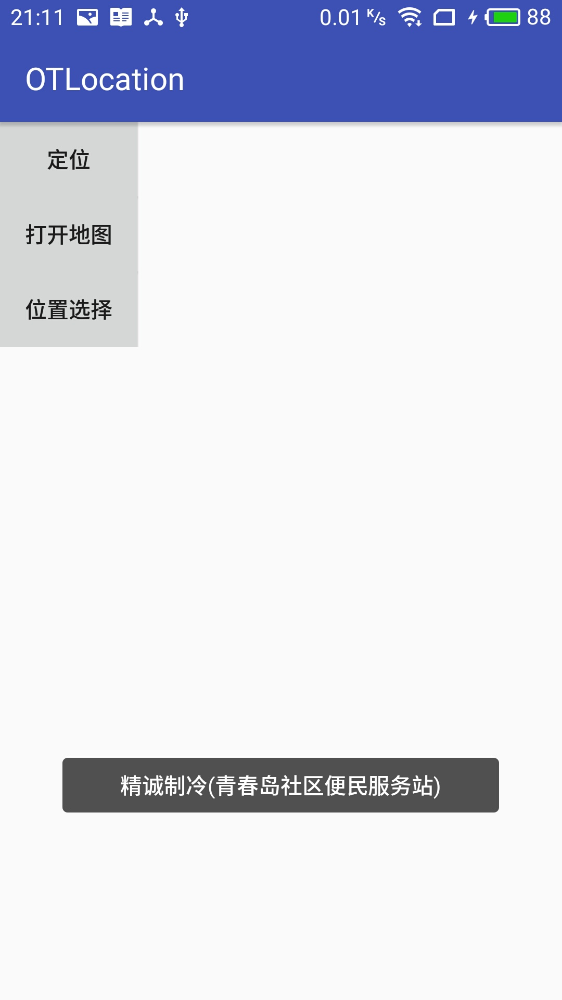
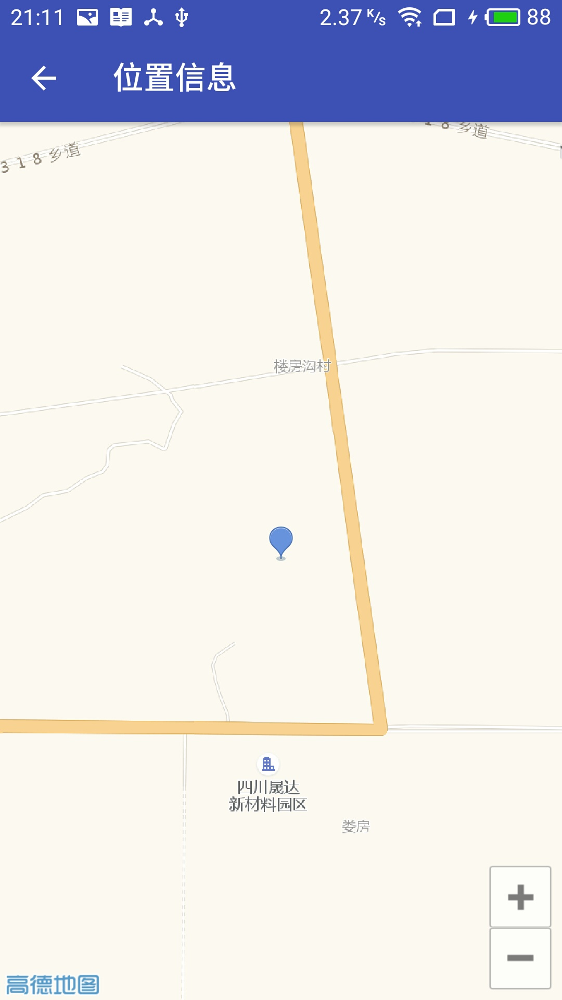
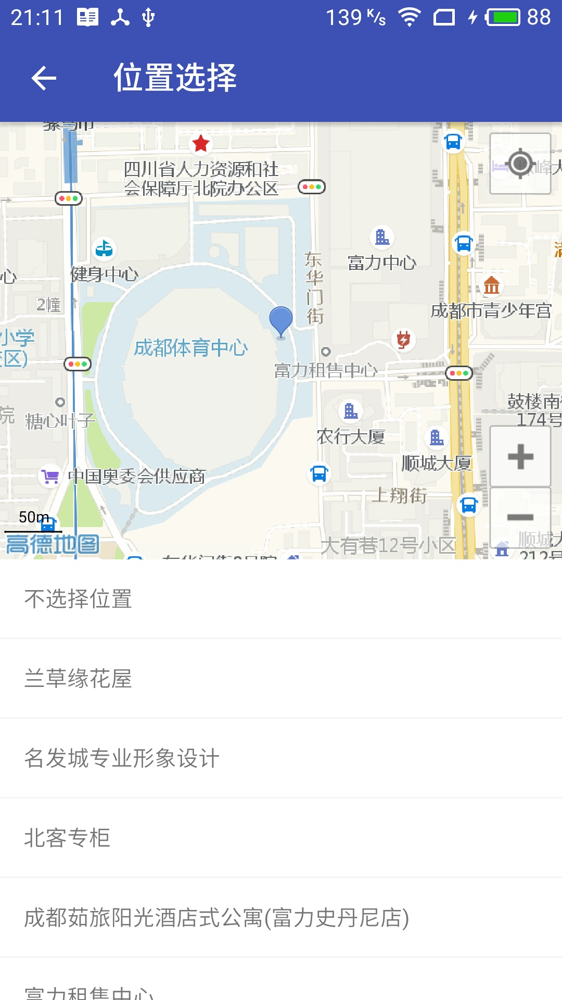

# OTLocation

Android 位置选择

For [旧时光](http://jiushig.com)

## Screenshot 
     


## Setup

To use this library your `minSdkVersion` must be >= 19

Add it in your root build.gradle at the end of repositories

```gradle
allprojects {
    repositories {
        ...
        maven { url 'https://www.jitpack.io' }
    }
}
```
Add the dependency
```gradle
dependencies {
        compile 'com.github.otjiushig:OTLocation:1.0.beta3'
}
```

## Usage

注意：
- 目前仅集成了高德地图。
- 使用前请自行申请定位权限。

添加依赖后，请前往高德地图开放平台自行申请定位key，并按照高德官方教程添加key。

#### 定位

```java
new LocationBuilder(this)
        .setmaxErrorNum(3)
        .setType(LocationBuilder.TYPE.GAO_DE)
        .setCallbackSuccess(locationInfo -> Toast.makeText(MainActivity.this, locationInfo.toString(), Toast.LENGTH_LONG).show())
        .setCallbackFail(msg -> Toast.makeText(MainActivity.this, msg, Toast.LENGTH_LONG).show())
        .start()
```

#### 打开地图

```java
findViewById(R.id.button1).setOnClickListener(view -> {
            MapActivity.start(this, 30.63, 106.07);
        });
```

#### 位置选择

```java
findViewById(R.id.button2).setOnClickListener(view -> {
            SelectActivity.start(this,"不选择位置");
        });
```
```java
@Override
protected void onActivityResult(int requestCode, int resultCode, Intent data) {
    super.onActivityResult(requestCode, resultCode, data);
    if (requestCode == SelectActivity.REQUEST_CODE) {
        if (resultCode == RESULT_OK) {
            Location location = (Location) data.getSerializableExtra("info");
            if (location != null)
                Toast.makeText(MainActivity.this, location.toString(), Toast.LENGTH_LONG).show();
        }
    }
}
```

Look at the sample app for more.

# License

```
Copyright (C) 2018 xia-weiyang

Licensed under the Apache License, Version 2.0 (the "License");
you may not use this file except in compliance with the License.
You may obtain a copy of the License at

   http://www.apache.org/licenses/LICENSE-2.0

Unless required by applicable law or agreed to in writing, software
distributed under the License is distributed on an "AS IS" BASIS,
WITHOUT WARRANTIES OR CONDITIONS OF ANY KIND, either express or implied.
See the License for the specific language governing permissions and
limitations under the License.
```
